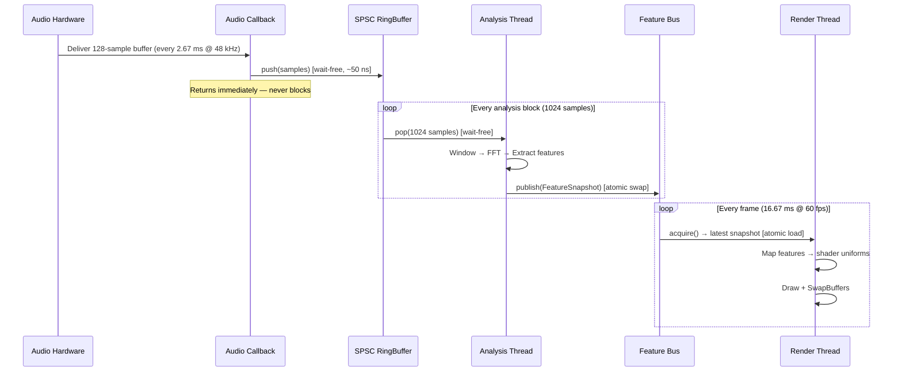

# Real-Time Audio Analysis Pipeline Architecture

> **Scope**: Complete data-flow architecture from audio capture through feature extraction to video render submission. Cross-platform (macOS / Windows / Linux). Target: audio-visual latency under 20 ms at 60 fps.

> **Related documents**: [ARCH_audio_io.md](ARCH_audio_io.md) | [ARCH_realtime_constraints.md](ARCH_realtime_constraints.md) | [REF_latency_numbers.md](REF_latency_numbers.md) | [VIDEO_opengl_integration.md](VIDEO_opengl_integration.md) | [IMPL_minimal_prototype.md](IMPL_minimal_prototype.md)

---

## 1. Pipeline Overview

The pipeline is a three-stage producer-consumer chain. Each stage runs on a dedicated thread with distinct scheduling priorities. Data flows forward only; no stage ever blocks on a downstream consumer.

```
┌─────────────────────────────────────────────────────────────────────────────┐
│                         AUDIO HARDWARE / OS LAYER                          │
│  ┌──────────┐   ┌──────────────┐   ┌──────────────────┐                   │
│  │  Mic /   │   │  Line-In     │   │  System Loopback │                   │
│  │  Input   │   │  (Analog)    │   │  (WASAPI/Screen  │                   │
│  └────┬─────┘   └──────┬───────┘   │   Audio/Pulse)   │                   │
│       │                │            └────────┬─────────┘                   │
│       └────────────────┴─────────────────────┘                             │
│                        │                                                   │
│              ┌─────────▼──────────┐                                        │
│              │   OS Audio Callback│  ← Interrupt / DPC context             │
│              │   (CoreAudio /     │    Period: 128–512 samples             │
│              │    WASAPI / JACK)  │    @ 44100–48000 Hz                    │
│              └─────────┬──────────┘                                        │
└────────────────────────┼────────────────────────────────────────────────────┘
                         │
            ┌────────────▼────────────┐
            │   SPSC Ring Buffer A    │  Lock-free, wait-free
            │   (Audio → Analysis)    │  Capacity: 4× analysis block
            └────────────┬────────────┘
                         │
            ┌────────────▼────────────┐
            │   ANALYSIS THREAD       │  Near-real-time priority
            │   ┌───────────────────┐ │
            │   │ Windowing (Hann)  │ │
            │   │ FFT (radix-2/4)   │ │
            │   │ Magnitude/Phase   │ │
            │   │ Feature Extract   │ │
            │   │  - RMS            │ │
            │   │  - Spectral Cent. │ │
            │   │  - Onset Detect   │ │
            │   │  - Chromagram     │ │
            │   │  - BPM Tracker    │ │
            │   └───────┬───────────┘ │
            └───────────┼─────────────┘
                        │
           ┌────────────▼────────────┐
           │   FEATURE BUS           │  Atomic snapshot swap
           │   (Analysis → Render)   │  Double/triple buffer
           └────────────┬────────────┘
                        │
           ┌────────────▼────────────┐
           │   RENDER THREAD (60fps) │
           │   ┌───────────────────┐ │
           │   │ Read feature snap │ │
           │   │ Map to uniforms   │ │
           │   │ Drive shaders /   │ │
           │   │  geometry / VJ    │ │
           │   │ SwapBuffers / VSync│ │
           │   └───────────────────┘ │
           └─────────────────────────┘
```

### Mermaid Sequence



### Design Invariants

1. **The audio callback never allocates, never locks, never syscalls.** It copies samples into the ring buffer and returns. See [ARCH_realtime_constraints.md](ARCH_realtime_constraints.md) for the full constraint catalog.
2. **The analysis thread may spin-wait on the ring buffer** (busy-poll with `std::this_thread::yield()`) but never blocks on a mutex.
3. **The render thread reads features opportunistically.** If the analysis thread has not published a new snapshot since the last frame, the render thread reuses the previous one. No stall.
4. **All inter-thread communication uses lock-free structures.** Zero mutexes on the hot path.

---

## 2. Lock-Free Data Structures

### 2.1 SPSC Ring Buffer

The backbone of the pipeline is a **Single-Producer Single-Consumer (SPSC) ring buffer**. SPSC is the simplest correct lock-free structure because exactly one thread writes and exactly one thread reads — no CAS loops, no ABA problem, no contention.

#### Memory Ordering

The correctness of SPSC depends on two atomic variables — `write_pos_` and `read_pos_` — and the correct use of acquire/release memory ordering:

| Operation | Ordering | Rationale |
|-----------|----------|-----------|
| Producer stores `write_pos_` | `memory_order_release` | Ensures all sample writes in the buffer are visible before the consumer sees the updated position. |
| Consumer loads `write_pos_` | `memory_order_acquire` | Pairs with the producer's release. Guarantees the consumer sees the data the producer wrote. |
| Consumer stores `read_pos_` | `memory_order_release` | Ensures the producer sees freed slots only after the consumer is done reading them. |
| Producer loads `read_pos_` | `memory_order_acquire` | Pairs with the consumer's release. Prevents the producer from overwriting data the consumer is still reading. |

`memory_order_seq_cst` would also be correct but is unnecessarily expensive — it issues full memory fences (MFENCE on x86, DMB ISH on ARM) instead of the cheaper store-release / load-acquire pairs (which are free on x86 and use STLR/LDAR on ARM).

#### C++ Implementation

```cpp
#pragma once
#include <atomic>
#include <cstddef>
#include <cstring>
#include <cassert>
#include <new>       // std::hardware_destructive_interference_size
#include <type_traits>

/// Wait-free SPSC ring buffer for trivially copyable types (e.g., float).
/// Capacity MUST be a power of two for branchless masking.
///
/// Producer: audio callback thread (real-time, must never block).
/// Consumer: analysis thread.
template <typename T, size_t Capacity>
class SPSCRingBuffer {
    static_assert(std::is_trivially_copyable_v<T>,
                  "T must be trivially copyable for memcpy semantics");
    static_assert((Capacity & (Capacity - 1)) == 0,
                  "Capacity must be a power of two");

public:
    SPSCRingBuffer() : write_pos_(0), read_pos_(0) {
        // Zero-initialize the buffer at construction time —
        // no allocation ever happens after this point.
        std::memset(buffer_, 0, sizeof(buffer_));
    }

    // ── Producer API (audio thread) ──────────────────────────────

    /// Try to push `count` contiguous samples. Returns the number
    /// of samples actually written (may be less if buffer is full).
    /// WAIT-FREE: constant-time, no loops, no retries.
    size_t try_push(const T* data, size_t count) noexcept {
        const size_t w = write_pos_.load(std::memory_order_relaxed);
        const size_t r = read_pos_.load(std::memory_order_acquire);
        const size_t available = Capacity - (w - r);
        const size_t n = (count < available) ? count : available;

        if (n == 0) return 0;

        const size_t idx = w & kMask;
        const size_t first = (Capacity - idx < n) ? (Capacity - idx) : n;
        const size_t second = n - first;

        std::memcpy(buffer_ + idx, data, first * sizeof(T));
        if (second > 0) {
            std::memcpy(buffer_, data + first, second * sizeof(T));
        }

        // Release: all memcpy writes are visible before we publish `w + n`.
        write_pos_.store(w + n, std::memory_order_release);
        return n;
    }

    // ── Consumer API (analysis thread) ───────────────────────────

    /// Try to pop `count` samples. Returns the number actually read.
    /// WAIT-FREE.
    size_t try_pop(T* out, size_t count) noexcept {
        const size_t r = read_pos_.load(std::memory_order_relaxed);
        const size_t w = write_pos_.load(std::memory_order_acquire);
        const size_t available = w - r;
        const size_t n = (count < available) ? count : available;

        if (n == 0) return 0;

        const size_t idx = r & kMask;
        const size_t first = (Capacity - idx < n) ? (Capacity - idx) : n;
        const size_t second = n - first;

        std::memcpy(out, buffer_ + idx, first * sizeof(T));
        if (second > 0) {
            std::memcpy(out + first, buffer_, second * sizeof(T));
        }

        // Release: consumer is done reading, producer may reuse these slots.
        read_pos_.store(r + n, std::memory_order_release);
        return n;
    }

    /// Number of samples available to read (approximate — races are benign).
    size_t available_read() const noexcept {
        return write_pos_.load(std::memory_order_acquire)
             - read_pos_.load(std::memory_order_relaxed);
    }

    /// Number of free slots available to write (approximate).
    size_t available_write() const noexcept {
        return Capacity
             - (write_pos_.load(std::memory_order_relaxed)
              - read_pos_.load(std::memory_order_acquire));
    }

private:
    static constexpr size_t kMask = Capacity - 1;

    // ── Cache-line isolation ─────────────────────────────────────
    // Pad write_pos_ and read_pos_ to separate cache lines to prevent
    // false sharing.  On most architectures, a cache line is 64 bytes.
    // C++17: std::hardware_destructive_interference_size (may not be
    // available on all compilers; fall back to 64).
    static constexpr size_t kCacheLineSize =
#ifdef __cpp_lib_hardware_interference_size
        std::hardware_destructive_interference_size;
#else
        64;
#endif

    alignas(kCacheLineSize) std::atomic<size_t> write_pos_;
    char pad1_[kCacheLineSize - sizeof(std::atomic<size_t>)];

    alignas(kCacheLineSize) std::atomic<size_t> read_pos_;
    char pad2_[kCacheLineSize - sizeof(std::atomic<size_t>)];

    alignas(kCacheLineSize) T buffer_[Capacity];
};
```

#### Key Design Decisions

- **Power-of-two capacity**: Allows `w & kMask` instead of `w % Capacity`. Modulo compiles to an integer division (~20–40 cycles on x86); bitwise AND is 1 cycle.
- **Monotonically increasing positions**: `write_pos_` and `read_pos_` are never reset to zero. They wrap naturally via unsigned overflow (well-defined for `size_t`). The mask extracts the physical index.
- **False-sharing prevention**: Without the padding, the producer's store to `write_pos_` would bounce the consumer's cache line (and vice versa), adding 40–70 ns of latency per access on modern Intel CPUs. See [REF_latency_numbers.md](REF_latency_numbers.md).
- **No `volatile`**: `volatile` is not a synchronization primitive in C++. `std::atomic` with explicit memory orderings is the correct mechanism.

### 2.2 Atomic Snapshot Swap (Feature Bus)

For the feature bus (Section 6), we use an atomic pointer swap rather than a ring buffer because the render thread only cares about the *latest* snapshot — it never processes a backlog. This is detailed in Section 6 below.

---

## 3. Thread Architecture

### 3.1 Thread Roles

| Thread | Priority | Scheduling | Runs at | Blocks on |
|--------|----------|------------|---------|-----------|
| **Audio callback** | Highest (real-time) | OS-managed (CoreAudio IOProc / WASAPI event / JACK process) | Every buffer period (2.67 ms @ 48 kHz / 128 samples) | **Nothing.** |
| **Analysis** | Above-normal | App-managed, spin-yield on ring buffer | Whenever 1 hop of samples (512–1024) is available | Ring buffer empty → `yield()` then retry |
| **Render** | Normal | VSync-driven or timer-driven | 60 fps (16.67 ms) | VSync / `glFinish` |
| **UI / Control** | Normal | Event loop | On user input | OS event queue |

### 3.2 Audio Callback Thread

The audio callback is invoked by the OS audio subsystem. On macOS (CoreAudio), this is an IOProc running on a real-time thread managed by the Audio HAL. On Windows (WASAPI exclusive mode), it is an MMCSS "Pro Audio" thread. On Linux (JACK), it is a SCHED_FIFO thread.

**The callback does exactly one thing**: copies incoming samples into the SPSC ring buffer.

```cpp
// CoreAudio IOProc example (macOS)
OSStatus audioCallback(
    AudioObjectID                     device,
    const AudioTimeStamp*             now,
    const AudioBufferList*            inputData,
    const AudioTimeStamp*             inputTime,
    AudioBufferList*                  outputData,
    const AudioTimeStamp*             outputTime,
    void*                             clientData)
{
    auto* pipeline = static_cast<AudioPipeline*>(clientData);
    const auto* buffer = inputData->mBuffers[0];
    const float* samples = static_cast<const float*>(buffer.mData);
    const size_t frameCount = buffer.mDataByteSize / sizeof(float);

    size_t written = pipeline->ringBuffer.try_push(samples, frameCount);
    if (written < frameCount) {
        pipeline->xrunCounter.fetch_add(1, std::memory_order_relaxed);
    }
    // Zero output if pass-through is not needed
    if (outputData) {
        std::memset(outputData->mBuffers[0].mData, 0,
                    outputData->mBuffers[0].mDataByteSize);
    }
    return noErr;
}
```

**Prohibited operations inside the callback** (see [ARCH_realtime_constraints.md](ARCH_realtime_constraints.md)):
- `malloc` / `free` / `new` / `delete`
- `pthread_mutex_lock` / `std::mutex::lock`
- `objc_msgSend` (Objective-C message dispatch)
- Any syscall that may block (`read`, `write`, `open`, `stat`)
- `printf`, `NSLog`, `std::cout`

### 3.3 Analysis Thread

The analysis thread runs in a spin-yield loop, draining the ring buffer as fast as data arrives. It processes fixed-size blocks (the FFT window size, typically 2048 samples with a 512-sample hop).

```cpp
void analysisThreadFunc(AudioPipeline* pipeline) {
    setThreadPriority_AboveNormal(); // Platform-specific, see below

    constexpr size_t kFFTSize = 2048;
    constexpr size_t kHopSize = 512;

    // Pre-allocated work buffers — no heap allocation in the loop.
    alignas(32) float inputBlock[kFFTSize];
    alignas(32) float windowedBlock[kFFTSize];
    alignas(32) float fftReal[kFFTSize];
    alignas(32) float fftImag[kFFTSize];
    alignas(32) float magnitudes[kFFTSize / 2 + 1];

    FeatureSnapshot snap{};
    HannWindow window(kFFTSize);   // Precomputed at startup
    FFTPlan fftPlan(kFFTSize);     // Precomputed twiddle factors

    size_t overlapBuffer_count = 0;
    float overlapBuffer[kFFTSize]; // For overlap-save

    while (!pipeline->shouldStop.load(std::memory_order_relaxed)) {
        // Drain one hop at a time
        float hopSamples[kHopSize];
        size_t got = pipeline->ringBuffer.try_pop(hopSamples, kHopSize);

        if (got == 0) {
            // No data available — yield CPU then retry.
            // Do NOT sleep (sleep granularity is 1–15 ms, far too coarse).
            std::this_thread::yield();
            continue;
        }

        // Shift overlap buffer and append new hop
        std::memmove(overlapBuffer, overlapBuffer + kHopSize,
                     (kFFTSize - kHopSize) * sizeof(float));
        std::memcpy(overlapBuffer + (kFFTSize - kHopSize),
                    hopSamples, kHopSize * sizeof(float));

        // Apply window
        window.apply(overlapBuffer, windowedBlock, kFFTSize);

        // FFT
        fftPlan.forward(windowedBlock, fftReal, fftImag);

        // Magnitude spectrum
        for (size_t i = 0; i <= kFFTSize / 2; ++i) {
            magnitudes[i] = std::sqrt(
                fftReal[i] * fftReal[i] + fftImag[i] * fftImag[i]);
        }

        // ── Feature Extraction ──
        snap.timestamp = pipeline->sampleClock.load(std::memory_order_relaxed);
        snap.rms = computeRMS(overlapBuffer, kFFTSize);
        snap.peak = computePeak(overlapBuffer, kFFTSize);
        snap.spectralCentroid = computeSpectralCentroid(
            magnitudes, kFFTSize / 2 + 1, 48000.0f);
        snap.spectralFlatness = computeSpectralFlatness(
            magnitudes, kFFTSize / 2 + 1);
        snap.zeroCrossingRate = computeZCR(overlapBuffer, kFFTSize);
        snap.onsetDetected = detectOnset(snap, pipeline->prevSnap);

        // Band energies (e.g., sub/low/mid/high/presence/brilliance)
        computeBandEnergies(magnitudes, kFFTSize / 2 + 1, 48000.0f,
                           snap.bandEnergies);

        // BPM tracking (runs its own internal accumulator)
        pipeline->bpmTracker.process(snap.onsetDetected, snap.timestamp);
        snap.bpm = pipeline->bpmTracker.currentBPM();
        snap.beatPhase = pipeline->bpmTracker.phase();

        // Publish to feature bus
        pipeline->featureBus.publish(snap);

        pipeline->prevSnap = snap;
    }
}
```

### 3.4 Thread Priority Configuration

Thread priority must be set per-platform. The audio callback thread is managed by the OS audio subsystem and already runs at real-time priority. The analysis thread should be elevated above normal but below real-time.

```cpp
#include <thread>

#if defined(__APPLE__)
#include <mach/mach.h>
#include <mach/thread_policy.h>
#include <pthread.h>

void setRealtimePriority() {
    // For threads we manage (not the CoreAudio IOProc, which is already RT).
    mach_timebase_info_data_t timebase;
    mach_timebase_info(&timebase);

    thread_time_constraint_policy_data_t policy;
    policy.period      = static_cast<uint32_t>(
        48000.0 / 512.0 * 1e9 * timebase.denom / timebase.numer);
    policy.computation = static_cast<uint32_t>(
        0.5e6 * timebase.denom / timebase.numer);   // 0.5 ms
    policy.constraint  = static_cast<uint32_t>(
        1.0e6 * timebase.denom / timebase.numer);   // 1.0 ms
    policy.preemptible = true;

    thread_policy_set(
        mach_thread_self(),
        THREAD_TIME_CONSTRAINT_POLICY,
        reinterpret_cast<thread_policy_t>(&policy),
        THREAD_TIME_CONSTRAINT_POLICY_COUNT);
}

void setAboveNormalPriority() {
    struct sched_param param;
    param.sched_priority = 47;  // macOS: 0–47 normal range, 48+ RT
    pthread_setschedparam(pthread_self(), SCHED_RR, &param);
}

#elif defined(_WIN32)
#include <windows.h>
#include <avrt.h>
#pragma comment(lib, "avrt.lib")

void setRealtimePriority() {
    // Register with MMCSS for "Pro Audio" task
    DWORD taskIndex = 0;
    HANDLE hTask = AvSetMmThreadCharacteristicsW(L"Pro Audio", &taskIndex);
    if (hTask) {
        AvSetMmThreadPriority(hTask, AVRT_PRIORITY_CRITICAL);
    }
}

void setAboveNormalPriority() {
    SetThreadPriority(GetCurrentThread(), THREAD_PRIORITY_ABOVE_NORMAL);
}

#elif defined(__linux__)
#include <pthread.h>
#include <sched.h>

void setRealtimePriority() {
    struct sched_param param;
    param.sched_priority = 80;  // SCHED_FIFO: 1–99, 80 is typical for audio
    pthread_setschedparam(pthread_self(), SCHED_FIFO, &param);
}

void setAboveNormalPriority() {
    struct sched_param param;
    param.sched_priority = 50;  // Below audio RT but above normal
    pthread_setschedparam(pthread_self(), SCHED_FIFO, &param);
}
#endif
```

### 3.5 Inter-Thread Communication Summary

```
Audio Thread ──[SPSC RingBuffer]──► Analysis Thread ──[Atomic Swap]──► Render Thread
                                                                          │
                                                          [Atomic flags]──┘
                                                          (xrun counter,
                                                           dropout flag)
```

No mutexes. No condition variables on the hot path. The analysis thread uses `std::this_thread::yield()` when the ring buffer is empty (not a condition variable wait, which would require a mutex). The render thread reads the latest feature snapshot via an atomic pointer load — it never waits for the analysis thread.

---

## 4. CPU Affinity & Memory

### 4.1 Pre-Allocation Strategy

Every buffer used in the hot path is allocated at startup and never freed until shutdown. The pipeline constructor performs all allocation:

```cpp
struct AudioPipeline {
    // All buffers allocated at construction — zero allocation at runtime.
    SPSCRingBuffer<float, 16384>  ringBuffer;     // ~341 ms @ 48 kHz
    FeatureBus                     featureBus;      // Triple-buffered snapshots
    BPMTracker                     bpmTracker;      // Internal onset history ring

    std::atomic<bool>   shouldStop{false};
    std::atomic<size_t> xrunCounter{0};
    std::atomic<size_t> sampleClock{0};

    FeatureSnapshot prevSnap{};

    AudioPipeline() {
        // Force all pages to be resident (prevent page faults in RT context).
        // On Linux: mlock() the audio thread's stack and all shared buffers.
        // On macOS: vm_protect with VM_FLAGS_FIXED | VM_MAKE_TAG.
        prefaultMemory();
    }
};
```

### 4.2 Memory Pool for Variable-Size Data

If the analysis pipeline ever needs variable-size allocations (e.g., dynamic chromagram bin counts per tuning system), use a pre-allocated pool:

```cpp
/// Fixed-capacity memory pool. All memory allocated upfront.
/// Thread-safe ONLY if used from a single thread (the analysis thread).
class AnalysisMemoryPool {
public:
    explicit AnalysisMemoryPool(size_t totalBytes)
        : storage_(new (std::align_val_t{64}) char[totalBytes])
        , capacity_(totalBytes)
        , offset_(0) {}

    ~AnalysisMemoryPool() {
        ::operator delete[](storage_, std::align_val_t{64});
    }

    void* allocate(size_t bytes, size_t alignment = 16) noexcept {
        size_t aligned = (offset_ + alignment - 1) & ~(alignment - 1);
        if (aligned + bytes > capacity_) return nullptr;  // Pool exhausted
        void* ptr = storage_ + aligned;
        offset_ = aligned + bytes;
        return ptr;
    }

    /// Reset the pool — "frees" all allocations. O(1).
    void reset() noexcept { offset_ = 0; }

private:
    char*  storage_;
    size_t capacity_;
    size_t offset_;
};
```

Call `pool.reset()` once per analysis block — this reclaims all scratch memory with zero overhead.

### 4.3 CPU Affinity (Pinning)

For predictable latency, pin the audio and analysis threads to specific cores. This prevents the OS scheduler from migrating threads across cores (which flushes L1/L2 caches, adding 5-20 us of jitter).

```cpp
#if defined(__linux__)
#include <sched.h>

void pinToCore(int coreId) {
    cpu_set_t cpuset;
    CPU_ZERO(&cpuset);
    CPU_SET(coreId, &cpuset);
    pthread_setaffinity_np(pthread_self(), sizeof(cpuset), &cpuset);
}
#elif defined(_WIN32)
void pinToCore(int coreId) {
    SetThreadAffinityMask(GetCurrentThread(), 1ULL << coreId);
}
#elif defined(__APPLE__)
// macOS does not support hard CPU affinity.
// Use thread_policy_set with THREAD_AFFINITY_POLICY as a *hint*:
void pinToCore(int affinityTag) {
    thread_affinity_policy_data_t policy = { affinityTag };
    thread_policy_set(
        mach_thread_self(),
        THREAD_AFFINITY_POLICY,
        reinterpret_cast<thread_policy_t>(&policy),
        THREAD_AFFINITY_POLICY_COUNT);
}
#endif
```

**Recommended core assignments**:
- Core 0: reserved for OS / interrupts
- Core 1: audio callback (if OS allows; typically OS-managed)
- Core 2: analysis thread
- Core 3+: render thread, UI thread

### 4.4 NUMA Considerations

On multi-socket workstations, ensure the ring buffer is allocated on the same NUMA node as the audio and analysis threads. On Linux, use `numa_alloc_onnode()` or `mbind()`. On single-socket desktop machines (the common case), NUMA is not a concern — all memory is equidistant.

For the ring buffer specifically, the producer (audio thread) and consumer (analysis thread) should be on the same NUMA node to avoid cross-node memory access penalties (~100 ns vs ~5 ns for local DRAM).

### 4.5 Page Faults and mlock

On Linux, use `mlockall(MCL_CURRENT | MCL_FUTURE)` or `mlock()` on specific allocations to prevent page faults in the audio/analysis paths. A page fault in the audio callback takes 5-15 us (SSD-backed swap) to milliseconds (HDD-backed), which is catastrophic at a 2.67 ms buffer period.

```cpp
#if defined(__linux__)
#include <sys/mman.h>
void prefaultAndLock(void* addr, size_t len) {
    // Touch every page to force the kernel to map them
    volatile char* p = static_cast<volatile char*>(addr);
    for (size_t i = 0; i < len; i += 4096) {
        p[i];  // Read-touch forces page allocation
    }
    mlock(addr, len);  // Prevent swap-out
}
#endif
```

---

## 5. Latency Budget

The total glass-to-glass latency (audio event occurs → corresponding visual appears on display) is the sum of every pipeline stage.

### 5.1 Stage-by-Stage Breakdown

| Stage | Description | Typical Latency | Notes |
|-------|-------------|-----------------|-------|
| **A. ADC conversion** | Analog-to-digital converter in audio interface | 0.5–1.5 ms | Hardware-dependent, fixed |
| **B. OS audio buffer** | Driver ring buffer, callback period | 2.67–10.67 ms | 128 samples @ 48 kHz = 2.67 ms; 512 samples = 10.67 ms |
| **C. SPSC push** | `try_push()` in audio callback | ~0.05 ms | Cache-line store, negligible |
| **D. Ring buffer transit** | Time data sits in ring buffer waiting for analysis thread | 0–10.67 ms | Depends on hop size and thread scheduling; worst case = one full hop period |
| **E. FFT analysis** | Window + FFT + feature extraction | 0.1–0.5 ms | 2048-point FFT: ~15 us; feature extraction: ~50–100 us; total well under 0.5 ms |
| **F. Feature bus publish** | Atomic snapshot swap | ~0.01 ms | Single atomic store |
| **G. Render frame wait** | Time until next render frame reads the snapshot | 0–16.67 ms | Worst case: feature published just after render frame started |
| **H. GPU render** | Draw calls + shader execution | 1–5 ms | Depends on scene complexity |
| **I. Display scanout** | VSync + panel response | 4–16.67 ms | 60 Hz VSync = 16.67 ms worst case; 144 Hz = 6.9 ms; OLED response: <1 ms |

### 5.2 Total Latency Budget

| Scenario | A | B | C | D | E | F | G | H | I | **Total** |
|----------|---|---|---|---|---|---|---|---|---|-----------|
| **Best case** (128-sample buffer, 144 Hz display, instant scheduling) | 0.5 | 2.67 | 0.05 | 0.0 | 0.2 | 0.01 | 0.0 | 1.0 | 4.0 | **8.4 ms** |
| **Typical** (256-sample buffer, 60 Hz display) | 1.0 | 5.33 | 0.05 | 5.33 | 0.3 | 0.01 | 8.0 | 3.0 | 16.67 | **~24 ms** (see note) |
| **Worst case** (512-sample buffer, 60 Hz display, scheduling delays) | 1.5 | 10.67 | 0.05 | 10.67 | 0.5 | 0.01 | 16.67 | 5.0 | 16.67 | **~62 ms** |

> **Note on "typical"**: Stages D, G, and I involve random phase alignment. On average, D = half a hop period, G = half a frame period, I = half a VSync period. The typical case uses average values, not worst case.

**Average-case realistic estimate**: With a 256-sample buffer @ 48 kHz, 1024-sample FFT with 512-sample hop, and a 60 Hz display:

- A: 1.0 ms
- B: 5.33 ms
- C+F: ~0.06 ms (negligible)
- D: 5.33 ms average (half hop period)
- E: 0.3 ms
- G: 8.33 ms average (half frame period)
- H: 3.0 ms
- I: 8.33 ms average (half VSync period)
- **Total average: ~31.7 ms**

This is perceptually acceptable. Human audio-visual synchrony tolerance is approximately 45 ms for audio-leading-video and 120 ms for video-leading-audio (audio events appear to "cause" visual events, so video-leading is more forgiving). Our pipeline is well within budget.

### 5.3 Latency Reduction Strategies

1. **Smaller audio buffer** (128 samples): reduces B and D, but increases CPU load and xrun risk.
2. **Smaller FFT hop** (256 samples): reduces D, but increases analysis thread CPU load proportionally.
3. **Higher display refresh** (144 Hz): reduces G and I by ~2.5x.
4. **Predictive rendering**: Extrapolate features forward by the estimated pipeline latency to compensate. Effective for smooth features (RMS, spectral centroid) but not for transient events (onsets).
5. **Mailbox presentation mode** (Vulkan `VK_PRESENT_MODE_MAILBOX_KHR` / no VSync): eliminates stage I variability but introduces tearing.

For detailed latency reference numbers, see [REF_latency_numbers.md](REF_latency_numbers.md).

---

## 6. Feature Bus Design

### 6.1 Feature Snapshot Structure

All extracted features are packed into a single POD structure. This is the unit of transfer between the analysis and render threads.

```cpp
struct alignas(64) FeatureSnapshot {
    // ── Timing ──
    uint64_t timestamp;          // Sample clock at analysis time
    double   wallClockSeconds;   // std::chrono timestamp for render interpolation

    // ── Amplitude ──
    float rms;                   // Root mean square energy [0, 1]
    float peak;                  // Peak absolute sample value [0, 1]
    float rmsDB;                 // RMS in dBFS [-inf, 0]

    // ── Spectral ──
    float spectralCentroid;      // Brightness, in Hz
    float spectralFlatness;      // Noisiness [0, 1]  (1 = white noise)
    float spectralRolloff;       // Freq below which 85% of energy lies, Hz
    float spectralFlux;          // Frame-to-frame spectral change

    // ── Rhythm ──
    bool  onsetDetected;         // Transient onset flag (this frame)
    float onsetStrength;         // Onset detection function value
    float bpm;                   // Current estimated tempo
    float beatPhase;             // [0, 1) phase within current beat

    // ── Band Energies ──
    // Sub (20-60), Bass (60-250), LowMid (250-500), Mid (500-2k),
    // HighMid (2k-4k), Presence (4k-6k), Brilliance (6k-20k)
    float bandEnergies[7];

    // ── Pitch / Chroma ──
    float chromagram[12];        // Chroma energy per pitch class (C, C#, ..., B)
    float dominantPitch;         // Estimated fundamental frequency, Hz
    float pitchConfidence;       // [0, 1]

    // ── Smoothed / Derived ──
    float rmsSmoothed;           // EMA-smoothed RMS for visual envelope
    float centroidSmoothed;      // EMA-smoothed centroid

    // Padding to fill cache line boundary
    float _reserved[2];
};
static_assert(sizeof(FeatureSnapshot) % 64 == 0,
              "FeatureSnapshot must be cache-line aligned");
```

### 6.2 Triple-Buffer Atomic Swap

The feature bus uses a **triple buffer** — three snapshot slots, managed by a single atomic index. This design:

- Lets the producer (analysis) write at any speed without blocking
- Lets the consumer (render) read at any speed without blocking
- Guarantees the consumer always gets the *most recent complete* snapshot
- Never tears (the consumer never reads a partially-written snapshot)

```cpp
/// Lock-free triple buffer for SPSC feature delivery.
/// Producer writes to the "back" buffer, then swaps it to "ready".
/// Consumer swaps "ready" to "front" and reads from "front".
///
/// State encoding: a single atomic uint8_t stores three 2-bit indices.
/// Bits [1:0] = back index  (producer writes here)
/// Bits [3:2] = ready index (most recently completed write)
/// Bits [5:4] = front index (consumer reads here)
/// Bit  [6]   = newData flag (set by producer, cleared by consumer)
class FeatureBus {
public:
    FeatureBus() {
        // Initial assignment: back=0, ready=1, front=2, newData=0
        state_.store(0b0'10'01'00, std::memory_order_relaxed);
        // Zero-initialize all three snapshots
        for (auto& s : buffers_) {
            std::memset(&s, 0, sizeof(FeatureSnapshot));
        }
    }

    /// Called by the analysis thread after filling the back buffer.
    void publish(const FeatureSnapshot& snap) {
        uint8_t s = state_.load(std::memory_order_relaxed);
        uint8_t backIdx = s & 0x03;

        // Write to back buffer
        buffers_[backIdx] = snap;

        // Swap back ↔ ready, set newData flag
        // CAS loop to atomically swap indices
        uint8_t expected = s;
        uint8_t desired;
        do {
            expected = state_.load(std::memory_order_relaxed);
            backIdx = expected & 0x03;
            uint8_t readyIdx = (expected >> 2) & 0x03;
            uint8_t frontIdx = (expected >> 4) & 0x03;
            // New state: back=oldReady, ready=oldBack (just written), front=same
            desired = (frontIdx << 4) | (backIdx << 2) | readyIdx | 0x40;
        } while (!state_.compare_exchange_weak(
            expected, desired,
            std::memory_order_release,
            std::memory_order_relaxed));
    }

    /// Called by the render thread. Returns pointer to the latest snapshot.
    /// If no new data since last call, returns the same pointer (no copy).
    const FeatureSnapshot* acquire() {
        uint8_t s = state_.load(std::memory_order_relaxed);
        if (!(s & 0x40)) {
            // No new data — return current front buffer
            return &buffers_[(s >> 4) & 0x03];
        }

        // Swap front ↔ ready, clear newData flag
        uint8_t expected = s;
        uint8_t desired;
        do {
            expected = state_.load(std::memory_order_relaxed);
            uint8_t backIdx  = expected & 0x03;
            uint8_t readyIdx = (expected >> 2) & 0x03;
            uint8_t frontIdx = (expected >> 4) & 0x03;
            // New state: back=same, ready=oldFront, front=oldReady, newData=0
            desired = (readyIdx << 4) | (frontIdx << 2) | backIdx;
        } while (!state_.compare_exchange_weak(
            expected, desired,
            std::memory_order_acquire,
            std::memory_order_relaxed));

        return &buffers_[(desired >> 4) & 0x03];
    }

    /// Check if new data is available without consuming it.
    bool hasNewData() const noexcept {
        return state_.load(std::memory_order_relaxed) & 0x40;
    }

private:
    FeatureSnapshot buffers_[3];
    std::atomic<uint8_t> state_;
};
```

#### Why Triple Buffer, Not Double Buffer

With a double buffer and an atomic swap, the producer and consumer can collide: if the producer finishes a new frame while the consumer is still reading the previous "latest," the producer must either block (unacceptable) or drop its frame. A triple buffer guarantees:

- The producer always has a free buffer to write into (the back buffer is never the one the consumer is reading).
- The consumer always gets the most recent complete snapshot.
- If the producer is faster than the consumer, intermediate snapshots are silently dropped — exactly the desired behavior for a VJ engine.

### 6.3 Render Thread Consumption

```cpp
void renderLoop(AudioPipeline* pipeline, Renderer* renderer) {
    while (!pipeline->shouldStop.load(std::memory_order_relaxed)) {
        const FeatureSnapshot* snap = pipeline->featureBus.acquire();

        // Map features to visual parameters
        renderer->setUniform("u_rms", snap->rmsSmoothed);
        renderer->setUniform("u_centroid",
            mapRange(snap->spectralCentroid, 200.0f, 8000.0f, 0.0f, 1.0f));
        renderer->setUniform("u_onset",
            snap->onsetDetected ? 1.0f : 0.0f);
        renderer->setUniform("u_beatPhase", snap->beatPhase);

        for (int i = 0; i < 7; ++i) {
            char name[32];
            snprintf(name, sizeof(name), "u_band%d", i);
            renderer->setUniform(name, snap->bandEnergies[i]);
        }

        renderer->draw();
        renderer->swapBuffers();  // Blocks on VSync
    }
}
```

For the render thread's OpenGL/Vulkan integration details, see [VIDEO_opengl_integration.md](VIDEO_opengl_integration.md).

---

## 7. Error Handling

### 7.1 Audio Dropout (Xrun) Detection

An **xrun** (buffer overrun or underrun) occurs when the ring buffer is full and the audio callback cannot push new samples, or when the analysis thread falls behind and the ring buffer wraps. Both are detected by comparing the return value of `try_push()` / `try_pop()` to the requested count.

```cpp
// In audio callback:
size_t written = pipeline->ringBuffer.try_push(samples, frameCount);
if (written < frameCount) {
    // OVERRUN: analysis thread is not draining fast enough.
    pipeline->xrunCounter.fetch_add(1, std::memory_order_relaxed);
    pipeline->lastXrunType.store(XrunType::Overrun, std::memory_order_relaxed);
    // Samples are LOST. The audio callback must not retry or block.
}
```

The render thread (or a monitoring thread) periodically checks the xrun counter and can display a warning or log the event:

```cpp
size_t currentXruns = pipeline->xrunCounter.load(std::memory_order_relaxed);
if (currentXruns > lastReportedXruns) {
    LOG_WARN("Audio xrun detected ({} total). Analysis may be behind.",
             currentXruns);
    lastReportedXruns = currentXruns;
}
```

### 7.2 Analysis Thread Overload Detection

If the analysis thread consistently cannot process hops faster than they arrive, the ring buffer fills up and xruns occur. Detect this by monitoring the ring buffer fill level:

```cpp
// Inside analysis thread, periodically:
float fillRatio = static_cast<float>(pipeline->ringBuffer.available_read())
                / static_cast<float>(pipeline->ringBuffer.Capacity);

if (fillRatio > 0.75f) {
    // WARNING: buffer is 75% full, analysis is falling behind
    pipeline->analysisOverloadFlag.store(true, std::memory_order_relaxed);
}
```

### 7.3 Graceful Degradation

When the analysis thread cannot keep up, the system should degrade gracefully rather than produce stale or glitchy visuals:

| Fill Level | Action |
|------------|--------|
| < 50% | Normal operation |
| 50–75% | Increase hop size (skip every other hop) to halve CPU load |
| 75–90% | Disable expensive features (chromagram, BPM tracking) |
| > 90% | Emergency: only compute RMS and peak, skip FFT entirely |
| Overflow | Drop samples. Feature snapshot holds last-known-good values. Render thread continues with stale data. |

```cpp
enum class AnalysisQuality : uint8_t {
    Full,           // All features, full FFT
    Reduced,        // Larger hop, skip chromagram
    Minimal,        // RMS + peak only, no FFT
    Stale           // No analysis running, render uses last snapshot
};

AnalysisQuality computeQualityLevel(float fillRatio) {
    if (fillRatio < 0.50f) return AnalysisQuality::Full;
    if (fillRatio < 0.75f) return AnalysisQuality::Reduced;
    if (fillRatio < 0.90f) return AnalysisQuality::Minimal;
    return AnalysisQuality::Stale;
}
```

The current quality level is published atomically so the render thread can indicate it in the UI (e.g., a small "DEGRADED" badge).

### 7.4 Device Disconnection and Recovery

Audio devices can be unplugged at any time. The OS notifies the application via callbacks:

- **macOS**: `AudioObjectAddPropertyListener` on `kAudioHardwarePropertyDefaultInputDevice`
- **Windows**: `IMMNotificationClient::OnDeviceStateChanged`
- **Linux (PulseAudio)**: `pa_context_set_subscribe_callback`

On disconnection:

1. Stop the analysis thread's drain loop (it will spin on an empty buffer).
2. Set a `deviceDisconnected` atomic flag.
3. The render thread reads this flag and switches to a "no signal" visual state.
4. Attempt reconnection on a background thread (not the audio or analysis thread).
5. On reconnection, restart the audio callback and analysis drain loop.

```cpp
void onDeviceDisconnected(AudioPipeline* pipeline) {
    pipeline->deviceConnected.store(false, std::memory_order_release);
    // Analysis thread will naturally idle (ring buffer stays empty).
    // Render thread checks this flag and shows "No Audio Input" overlay.
}

void onDeviceReconnected(AudioPipeline* pipeline, AudioDeviceID newDevice) {
    pipeline->ringBuffer.reset();  // Drain any stale data
    pipeline->xrunCounter.store(0, std::memory_order_relaxed);
    startAudioCapture(pipeline, newDevice);
    pipeline->deviceConnected.store(true, std::memory_order_release);
}
```

### 7.5 Watchdog Timer

A background thread monitors overall pipeline health:

```cpp
void watchdogThread(AudioPipeline* pipeline) {
    using Clock = std::chrono::steady_clock;
    auto lastFeatureTime = Clock::now();

    while (!pipeline->shouldStop.load(std::memory_order_relaxed)) {
        std::this_thread::sleep_for(std::chrono::milliseconds(500));

        if (pipeline->featureBus.hasNewData()) {
            lastFeatureTime = Clock::now();
        } else {
            auto stale = Clock::now() - lastFeatureTime;
            if (stale > std::chrono::seconds(2)) {
                LOG_ERROR("Pipeline stall detected: no new features for {} ms",
                    std::chrono::duration_cast<std::chrono::milliseconds>(stale).count());
                pipeline->pipelineStalled.store(true, std::memory_order_relaxed);
                // Trigger recovery: restart analysis thread, reset ring buffer
            }
        }
    }
}
```

---

## 8. Complete Pipeline Integration

Putting it all together — the top-level initialization and teardown sequence:

```cpp
class RealTimeAudioVisualPipeline {
public:
    bool initialize(const PipelineConfig& config) {
        // 1. Pre-allocate everything
        ringBuffer_ = std::make_unique<SPSCRingBuffer<float, 16384>>();
        featureBus_ = std::make_unique<FeatureBus>();

        // 2. Start analysis thread (it will idle until audio arrives)
        analysisThread_ = std::thread([this, config]() {
            setAboveNormalPriority();
            #if defined(__linux__)
            pinToCore(2);
            #endif
            analysisThreadFunc(this, config);
        });

        // 3. Start audio capture (this creates the OS audio callback)
        if (!startAudioCapture(config.inputDevice, config.sampleRate,
                               config.bufferSize)) {
            return false;
        }

        // 4. Start watchdog
        watchdogThread_ = std::thread([this]() {
            watchdogThreadFunc(this);
        });

        return true;
    }

    void shutdown() {
        shouldStop.store(true, std::memory_order_release);
        stopAudioCapture();
        if (analysisThread_.joinable()) analysisThread_.join();
        if (watchdogThread_.joinable()) watchdogThread_.join();
    }

    // Public interface for render thread
    const FeatureSnapshot* acquireFeatures() {
        return featureBus_->acquire();
    }

    // Pipeline health queries (safe to call from any thread)
    size_t getXrunCount() const {
        return xrunCounter.load(std::memory_order_relaxed);
    }
    bool isDeviceConnected() const {
        return deviceConnected.load(std::memory_order_relaxed);
    }
    bool isPipelineStalled() const {
        return pipelineStalled.load(std::memory_order_relaxed);
    }

    // ── Shared state (atomics only) ──
    std::atomic<bool>   shouldStop{false};
    std::atomic<bool>   deviceConnected{true};
    std::atomic<bool>   pipelineStalled{false};
    std::atomic<size_t> xrunCounter{0};
    std::atomic<size_t> sampleClock{0};

private:
    std::unique_ptr<SPSCRingBuffer<float, 16384>> ringBuffer_;
    std::unique_ptr<FeatureBus>                    featureBus_;
    std::thread analysisThread_;
    std::thread watchdogThread_;
};
```

### Full Data-Flow Diagram (Mermaid)

```mermaid
graph LR
    subgraph "Audio Thread (RT Priority)"
        A[OS Audio Callback] --> B[SPSC RingBuffer Push]
    end

    subgraph "Analysis Thread (Above Normal)"
        C[SPSC RingBuffer Pop] --> D[Hann Window]
        D --> E[FFT]
        E --> F[Magnitude Spectrum]
        F --> G[Feature Extraction]
        G --> H[FeatureBus Publish]
    end

    subgraph "Render Thread (Normal, VSync)"
        I[FeatureBus Acquire] --> J[Map to Uniforms]
        J --> K[Draw Scene]
        K --> L[SwapBuffers]
    end

    subgraph "Watchdog Thread (Low)"
        M[Monitor fill levels] --> N[Check xrun count]
        N --> O[Detect stalls]
    end

    B -->|lock-free| C
    H -->|atomic swap| I
    B -.->|xrun counter| M
    C -.->|fill ratio| M

    style A fill:#ff6b6b,color:#fff
    style B fill:#ff6b6b,color:#fff
    style C fill:#ffa94d,color:#fff
    style D fill:#ffa94d,color:#fff
    style E fill:#ffa94d,color:#fff
    style F fill:#ffa94d,color:#fff
    style G fill:#ffa94d,color:#fff
    style H fill:#ffa94d,color:#fff
    style I fill:#69db7c,color:#000
    style J fill:#69db7c,color:#000
    style K fill:#69db7c,color:#000
    style L fill:#69db7c,color:#000
```



---

## Appendix A: Ring Buffer Sizing

The ring buffer capacity must accommodate the worst-case scheduling delay of the analysis thread. If the analysis thread is preempted for `T_preempt` milliseconds, the ring buffer must hold at least `sampleRate * T_preempt / 1000` samples without overflowing.

| Buffer Size (samples) | Duration @ 48 kHz | Survives preemption of |
|------------------------|--------------------|-----------------------|
| 4096 | 85 ms | ~85 ms |
| 8192 | 170 ms | ~170 ms |
| 16384 | 341 ms | ~341 ms |
| 32768 | 683 ms | ~683 ms |

**Recommendation**: 16384 samples (341 ms). This survives momentary scheduling hiccups (GC pauses in co-resident processes, GPU driver stalls, etc.) without excessive memory cost (64 KB for float32 mono).

For stereo input, either interleave channels in a single ring buffer (capacity = 16384 * 2 = 32768 floats) or use two independent ring buffers (one per channel). Two independent buffers have slightly better cache behavior because the analysis thread typically processes one channel at a time.

## Appendix B: Benchmark Targets

| Metric | Target | Measurement Method |
|--------|--------|--------------------|
| Audio callback duration | < 50 us | `mach_absolute_time()` / `QueryPerformanceCounter` around callback body |
| SPSC push latency | < 100 ns | rdtsc around `try_push()` |
| FFT (2048-point, float) | < 20 us | Benchmark with pffft / KissFFT / vDSP |
| Full feature extraction | < 200 us | Clock the analysis block |
| Feature bus publish | < 50 ns | rdtsc around `publish()` |
| Feature bus acquire | < 50 ns | rdtsc around `acquire()` |
| End-to-end pipeline | < 35 ms avg | Audio loopback with impulse → measure visual onset on photodiode |

See [IMPL_minimal_prototype.md](IMPL_minimal_prototype.md) for the benchmark harness implementation.
